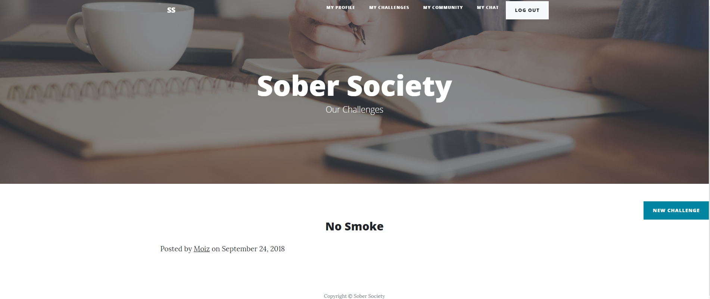
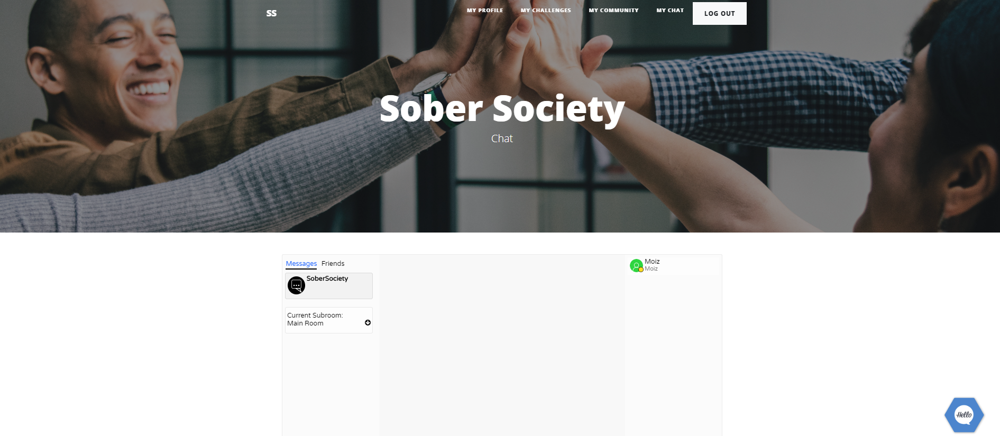

   
  

# SoberSociety
A Full-Stack Web Application, which aids people with their addiction recovery. Proudly developed at Starter Hacks 2019.

## Description
Mental illness is a serious medical conditions which isn't given enough attention to due to the lack of education and awareness. One factor of mental illness is addiction. Addicts face withdrawal symptoms, that make it very difficult to give up their bad habits, and this has a huge impact on their physical and mental wellness.

With this web application, addicts get all the support they need, with accountability, and the ability to share their progress. Thus allowing them to finally end their addictions.

## Features
1. A fully functional blog, which allows users to share their experiences with their addictions through posts. As well as receive feed back from others via the comments.
2. A challenges system which allows users to take part in specific challenges, as well as create their own challenges, and track their progress. Also allows other users to participate in these challenges, for added accountability and motivation.
3. A chatroom, which allows users to interact with other users tackling addition, to prevent relapse from occurring in moments of desperation.

## Screenshots

   
  
  

